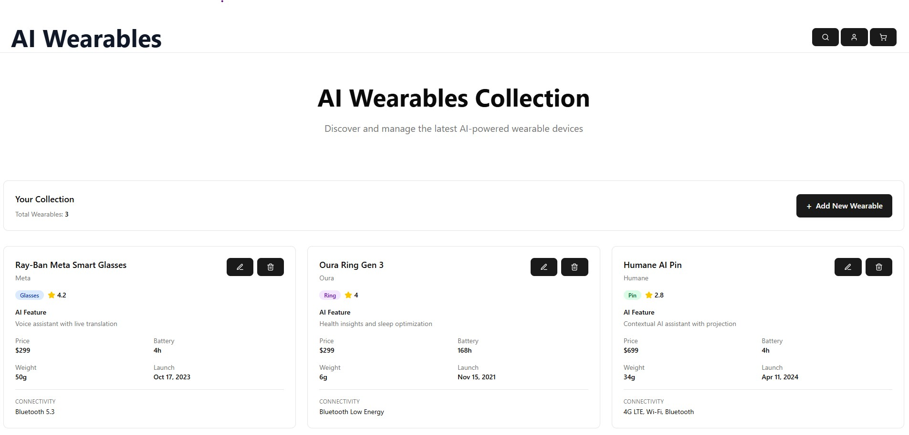

<div align="center">

# AI Wearables 🕶️⌚️

A **React + TypeScript** playground for cataloguing the fast‑growing family of AI‑powered wearables — smart glasses, rings, pins, earbuds, and more.

[](LICENSE)
[](https://github.com/iliasd752/ai-wearables/pulls)
[](https://react.dev)
[](https://www.typescriptlang.org)
[](https://tailwindcss.com)

<br/>



</div>

---

## ✨ Features

| 🔍  | **Interactive catalogue** of AI devices (Ray‑Ban Meta Glasses, Oura Ring Gen 3, Humane AI Pin). |
| --- | ----------------------------------------------------------------------------------------------- |
| 🛠   | **CRUD UI** – add, edit, delete devices.                                                        |
| ⚡  | **Instant prototyping** – backend‑free local state, replace with API when you want.             |
| 🎨  | **Modern stack** – Vite 7, React 19, TypeScript 5.8, Tailwind 4, shadcn/ui, lucide icons.       |
| 📊  | **Rich specs** at a glance: form‑factor, battery, weight, price, release, connectivity.         |

---

## 📑 Table of Contents

- [Getting Started](#-getting-started)
- [Project Structure](#-project-structure)
- [How It Works](#-how-it-works)
- [NPM Scripts](#-npm-scripts)
- [Extending the Project](#-extending-the-project)
- [Contributing](#-contributing)
- [License](#-license)
- [Credits](#credits)

---

## 🏃‍♂️ Getting Started

<details>
<summary><strong>Clone & install</strong></summary>

```bash
git clone https://github.com/iliasd752/ai-wearables.git
cd ai-wearables
git checkout feature/add-wearable   # or main when merged
npm install                         # or yarn / pnpm
```

</details>

<details>
<summary><strong>Run the dev server</strong></summary>

```bash
npm run dev
```

Head to [http://localhost:5173](http://localhost:5173) — HMR 🔥 enabled.

</details>

<details>
<summary><strong>Build & preview</strong></summary>

```bash
npm run build   # production bundle → /dist
npm run preview # serve the build locally
```

</details>

---

## 🗺️ Project Structure

```text
ai-wearables/
├── public/               # Static assets
├── src/
│   ├── components/       # UI building blocks
│   │   ├── WearableCard.tsx
│   │   ├── WearableList.tsx
│   │   └── AddWearableForm.tsx
│   ├── hooks/
│   │   └── useWearablesStore.ts      # Tiny “store” built with useState
│   ├── lib/
│   │   ├── types.ts                  # Shared TypeScript types
│   │   └── utils.ts                  # Utility helpers
│   ├── App.tsx
│   └── main.tsx
├── index.html
├── tailwind.config.ts
└── package.json
```

---

## 🧠 How It Works

| Layer           | Tech & Purpose                                                                  |
| --------------- | ------------------------------------------------------------------------------- |
| **State**       | `useWearablesStore` — simple `useState` array (swap for Zustand / Redux / API). |
| **Forms**       | `react-hook-form` for state & validation.                                       |
| **Styling**     | Tailwind CSS utilities + shadcn/ui components.                                  |
| **Icons**       | `lucide-react` SVG set.                                                         |
| **Type Safety** | All code in **TypeScript 5.8** with `strict` on.                                |

---

## 🔧 NPM Scripts

```text
npm run dev     # start Vite in dev mode (HMR)
npm run build   # type‑check & production build
npm run preview # local web server for /dist
npm run lint    # ESLint codebase check
```

---

## 🛠️ Extending the Project

> 💡 These are just starting points — PRs welcome!

- **Search & Filters** – enhance `WearableList.tsx`.
- **Persistence** – wire up localStorage, IndexedDB, or a cloud API.
- **Dark Mode** – Tailwind makes it a one‑liner.
- **Tests** – Jest + React Testing Library for peace of mind.

---

## 🤝 Contributing

1. **Fork** the repo → `git clone YOUR_FORK_URL`.
2. **Branch** → `git checkout -b feat/amazing`.
3. **Commit** → `git commit -m "feat: add amazing feature"`.
4. **Push** & open a **Pull Request**.

Please run `npm run lint` before pushing.&#x20;
💚 **All contributions / issues / ideas are welcome!**

---

## 📄 License

Released under the **MIT License**. See [LICENSE](LICENSE) for details.

---

### Credits

Created & maintained by **iliasd752**.
Sample data adapted from official product pages for Ray‑Ban Meta Glasses, Oura Ring Gen 3, and Humane AI Pin.
Icons by [lucide.dev](https://lucide.dev).
